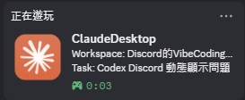

# Claude Discord Presence

## Prerequisites

Before installing this plugin, install **Node.js LTS** (Node.js 20 or later is recommended), because the hooks and Discord Presence daemon run through `node`. Verify the installation in a terminal:

```text
node --version
```

If the `node` command is not found, install Node.js and restart Claude Desktop.

<p align="center">
  
</p>

Show a local Discord Rich Presence while Claude Desktop is running. The plugin does not upload prompts, project contents, or chat messages to the plugin author. It can optionally show the active project and a repository button. Conversation-title display is enabled by default; the plugin reads the local Claude transcript to find custom-title records and sends only the selected title to Discord.

[Privacy Policy](PRIVACY.md) · [Terms of Service](TERMS.md) · [MIT License](LICENSE)

## Example



## Install

Install the public marketplace from a terminal:

```text
claude plugin marketplace add mushroomTW/claude-discord-presence
```

Then open the Claude Desktop **Plugins** page, find **Claude Discord Presence**
in the `claude-discord-presence` marketplace, and select **Install**. Restart
Claude Desktop if it is already open, then open or resume a Claude session.
After updating the plugin, start a new Claude session so the current version
replaces any older Presence daemon.

## Setup

The plugin includes the Discord Application created by mushroomTW. Users do not need to create a Discord Application or provide an Application ID.

## Controls

- Start: `node ./scripts/start.js`
- Stop: `node ./scripts/stop.js`
- Status: `node ./scripts/claude-discord-presence.js --status`

The plugin uses Node.js and Discord IPC only. It supports Windows, macOS, and Linux.

## Development checks

Run the built-in tests with:

```text
node --test
```

Rich Presence starts from Claude's `SessionStart` hook and stops from its `SessionEnd` hook. The plugin does not create an operating-system startup entry, so it can be installed, disabled, and removed through Claude without leaving a startup task behind.

All Claude installation scopes share the same local daemon and session data. On the first start after an update, the plugin cleans up older daemons created by previous installation scopes. Workspace is shown only for recent sessions whose workspace is not inside the user's home directory or Claude data directory. Otherwise, the plugin keeps a generic Presence and does not expose the Windows username.

## Configuration

Edit `scripts/config.json` inside the installed plugin directory, then restart the Rich Presence service.

Content updates are event-driven by default (`pollIntervalMs: 0`). Set `pollIntervalMs` to a positive millisecond value only when a filesystem watcher is unreliable and a fallback poll is needed.

`useBroker` defaults to `true`: Claude publishes its activity to the shared local Broker, which is the only process that connects to Discord IPC. The plugin bundles the Broker at `scripts/broker.js` and the daemon starts it automatically when no Broker heartbeat is present, so no manual step is required. The Broker enforces a single running instance, so Claude and Codex can both enable it safely. Set `useBroker` to `false` only if you want the plugin to talk to Discord IPC directly.

The repository intentionally keeps only the Broker bundled with the plugin. For manual development or standalone execution, use the workspace-level `discord-presence-broker/broker.js`; it is the reference source shared by the Claude and Codex plugin copies.

### Project display

```json
{
  "details": "Using Claude",
  "state": "Vibe coding",
  "showProject": true,
  "showConversationTitle": true,
  "projectLabel": "Workspace"
}
```

- Set `showProject` to `true` to display the active project name.
- Change `projectLabel` to customize the project-name prefix.
- Set `showConversationTitle` to `false` if you do not want the plugin to read the local transcript for a custom conversation title. The title is shown as the Rich Presence state.
- Change `state` to customize the fallback text used when conversation-title display is disabled or no title is available.

### Repository button

```json
{
  "showRepositoryButton": true,
  "repositoryButtonLabel": "View Repository"
}
```

The button uses the current project's Git `origin` remote when it points to GitHub. Set `showRepositoryButton` to `false` to hide it. Projects without a GitHub `origin` remote do not show a button, and private repositories still require GitHub permission.

## Notes

Run Discord and Claude Desktop with the same privileges. On Linux and macOS, use the Discord desktop app and ensure the current user can access the Discord IPC socket.
